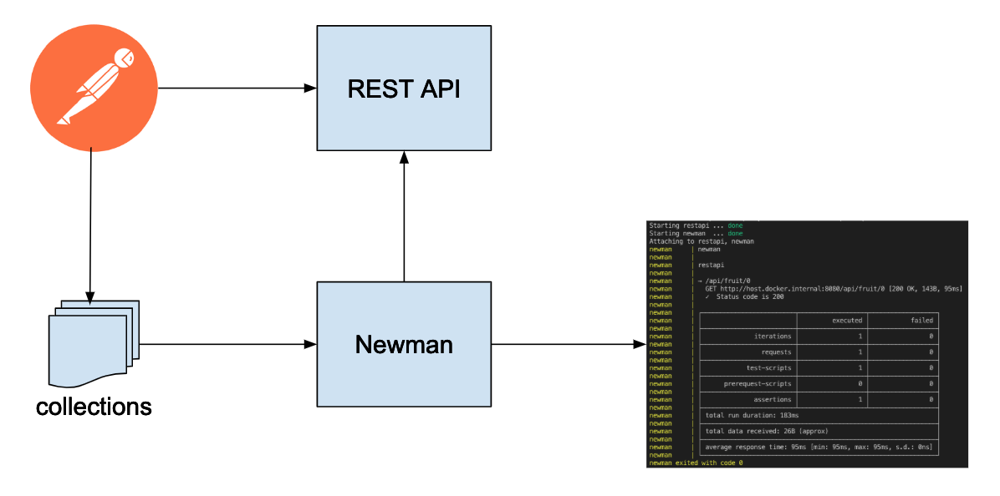
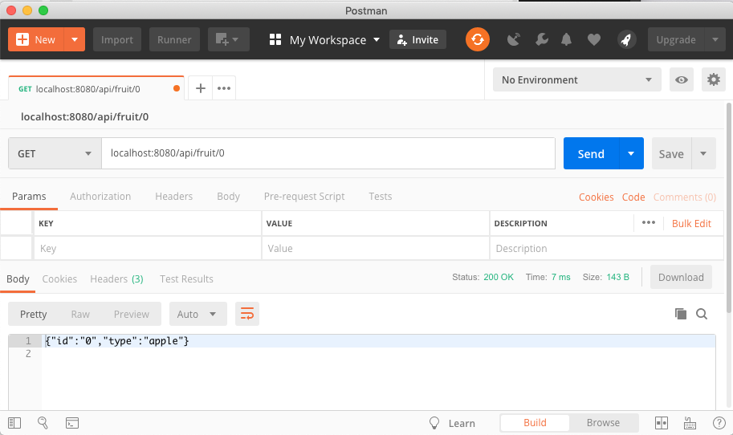
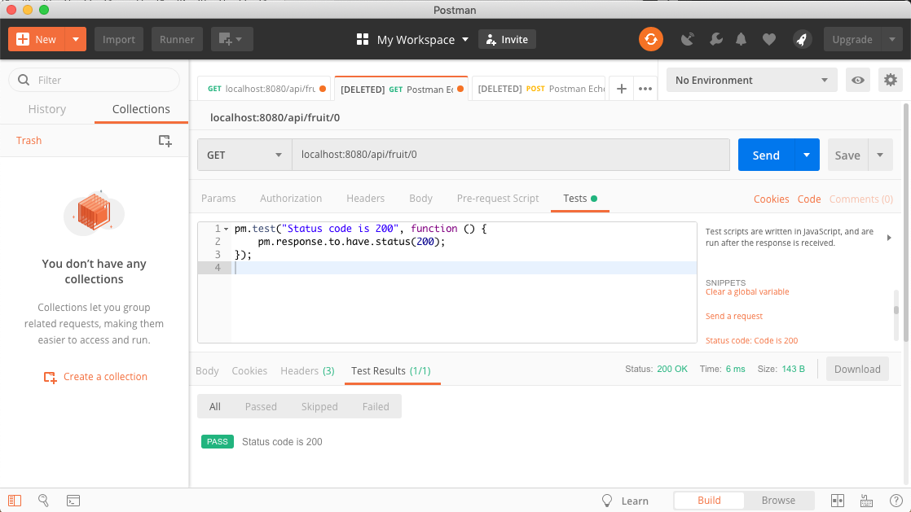
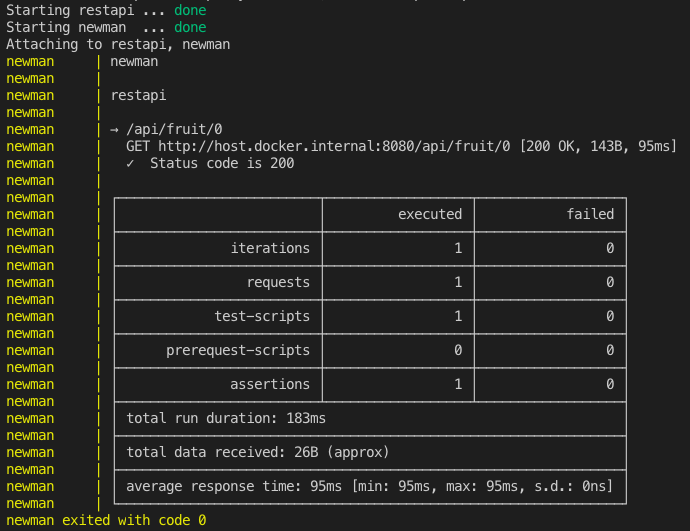

# postman-api-systest
Use Postman, Newman and Docker to create an API system test to test a REST service.  

<p  align="center">
    
</p>


Follow the steps below to create a starter system test which tests **restapi** a simple REST service:

1. clone https://github.com/jimareed/restapi (and cd into the directory)

2. build the docker image
```
docker build --tag restapi-image .
```

3. start the service
```
docker run --name restapi -p 8080:8080 -d restapi-image
```

4. test the service, list the fruit
```
curl localhost:8080/api/fruit 
```
returns:
```
[{"id":"0","type":"apple"},{"id":"1","type":"orange"},{"id":"2","type":"pear"}]
```

5. clone this repo (and cd into the directory)

6. install postman https://www.getpostman.com/

7. start postman and make a rest call to get an item: http://localhost:8080/api/fruit/0

<p  align="center">
    
</p>

8. create a test to verify the status code is 200 

<p  align="center">
    
</p>

9. create a collection in Postman and add the request to the collection, export the collection as **./collections/test-collection.json**

10. stop the container
```
docker stop restapi
docker rm restapi
```

11. edit ./collections/test-collection.json, replase `localhost` with `host.docker.internal`

12. a docker-compose.yaml is included which starts the restapi service and starts the Postman Newman Docker container to run the tests.  Run docker compose to run the system test.  Verify that the test runs successfully.

```
docker-compose up
```

<p  align="left">
    
</p>


13. Hit ctrl-c to exit and then shutdown the containers

```
docker-compose down
```
